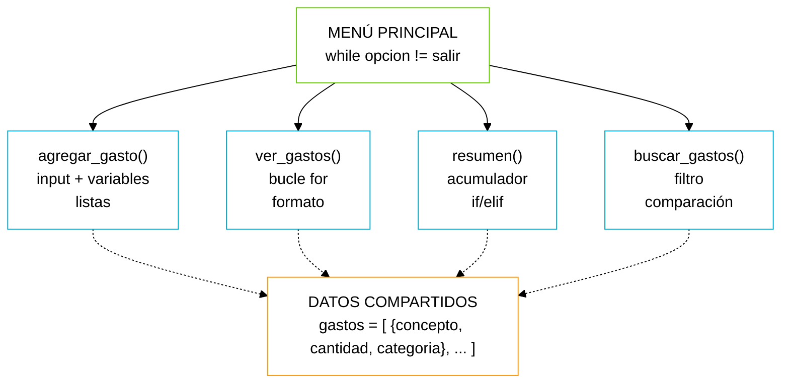

# Personal Expenses Manager

El proyecto que vas a construir es un gestor de gastos personal por consola. El programa permite registrar gastos, verlos clasificados por categoría, calcular totales y mostrar estadísticas. Es un problema real — mucha gente necesita exactamente esto para controlar sus finanzas. Y combina absolutamente todo lo que has aprendido.

Antes de escribir ni una línea de código, vamos a pensar. Recuerda la lección 1: si no puedes explicar tu programa en una servilleta, es demasiado complejo. Vamos a desglosar el problema en partes pequeñas:

1. El programa muestra un MENÚ con opciones (bucle while — se repite hasta que el usuario elija salir).
2. El usuario puede AÑADIR un gasto (input + variables + almacenamiento en lista).
3. El usuario puede VER todos los gastos (bucle for para recorrer la lista).
4. El usuario puede ver un RESUMEN por categoría (bucle + condicional + acumulador).
5. Cada operación es una FUNCIÓN separada (organización y reutilización).

